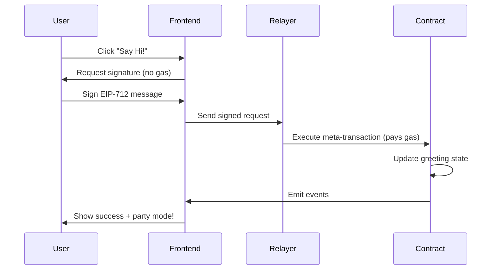

# 🌸 PolkaGreet - Gasless Interactions on Polkadot

**A meta-transaction demonstration showcasing gasless interactions on Polkadot's Paseo Asset Hub**

Built with ❤️ by **Kaan Kacar** at **EthBelgrade 2024**

---

## 🎯 Overview

PolkaGreet is a demonstration project that showcases the power of meta-transactions on Polkadot. It allows users to interact with smart contracts without needing native tokens for gas fees. Users simply sign messages with their wallets, and a relayer service handles the actual transaction execution and gas payment.

### 🚀 Live Demo

- **Frontend**: Running on `http://localhost:3004/`
- **Network**: Paseo Asset Hub (Testnet)
- **Contracts**: Deployed and verified on-chain

## ✨ Key Features

- **🆓 Gasless Interactions**: Users don't need native tokens to interact with contracts
- **🔐 EIP-712 Signatures**: Industry-standard typed data signatures for security
- **⚡ Instant Execution**: Relayer processes transactions immediately
- **🎨 Beautiful UI**: Polkadot-themed interface with party mode animations
- **📱 Mobile Responsive**: Works seamlessly across all devices
- **🔗 MetaMask Integration**: Easy wallet connection and interaction

## 🏗️ Architecture

### Smart Contracts

1. **PolkaGreetContract** (`0xD892416A56F0B01a1442De6F78EafEFaDb2D8211`)
   - Main greeting contract with `sayHi()` functionality
   - Built with ERC2771 context for trusted forwarder support
   - Maintains greeting state and statistics

2. **MetaTxRelayer** (`0x6fb6E63C01B68e9EDB719e26048aaA62A372Fb95`)
   - Trusted forwarder contract implementing meta-transaction logic
   - Validates EIP-712 signatures and executes forwarded calls
   - Manages user nonces to prevent replay attacks

### Infrastructure Components

- **Frontend**: React TypeScript application with modern Polkadot theming
- **Relayer Service**: Node.js service that monitors and executes meta-transactions
- **Smart Contracts**: Solidity contracts compiled for PolkaVM

## 🔧 Technical Implementation

### Meta-Transaction Flow



### Key Technologies

- **PolkaVM**: Polkadot's virtual machine for smart contract execution
- **EIP-712**: Structured data signing standard
- **ERC2771**: Meta-transaction standard for trusted forwarders
- **React + TypeScript**: Modern frontend framework
- **Ethers.js**: Ethereum library for blockchain interaction
- **Hardhat**: Development and deployment framework

## 📋 Prerequisites

- **Node.js** (v18 or higher)
- **npm** or **yarn**
- **MetaMask** browser extension
- **Git**

## 🚀 Quick Start

### 1. Clone the Repository

```bash
git clone <your-repository-url>
cd storage-hardhat1
```

### 2. Install Dependencies

```bash
npm install
```

### 3. Environment Setup

The project is pre-configured for Paseo Asset Hub with deployed contracts. No additional environment setup is required for testing.

### 4. Start the Relayer Service

```bash
node scripts/polkagreet-relayer.js 0x6fb6E63C01B68e9EDB719e26048aaA62A372Fb95 0xD892416A56F0B01a1442De6F78EafEFaDb2D8211
```

Expected output:
```
🚀 Initializing PolkaGreet Relayer...
📍 Relayer Address: 0xfca1A55A31dd5408fA136D30031b94E63Efc325c
✅ Relayer initialized successfully!
👂 Relayer is now listening for greeting requests...
💰 Relayer Balance: 47.97118324415 WND
🌸 PolkaGreet Relayer is ready to process meta-transactions!
```

### 5. Start the Frontend

```bash
cd frontend
npm start
```

The application will be available at `http://localhost:3000` (or another port if 3000 is busy).

### 6. Connect and Test

1. Open the application in your browser
2. Connect your MetaMask wallet
3. Switch to Paseo Asset Hub network (will be prompted automatically)
4. Click "Say Hi!" to send a gasless greeting
5. Enjoy the party mode celebration! 🎉

## 🔧 Development

### Project Structure

```
storage-hardhat1/
├── contracts/              # Smart contracts
│   ├── PolkaGreetContract.sol
│   ├── MetaTxRelayer.sol
│   └── IERC2771Context.sol
├── scripts/                # Deployment and utility scripts
│   ├── deploy-polkagreet.js
│   └── polkagreet-relayer.js
├── test/                   # Contract tests
│   └── PolkaGreet.test.js
├── frontend/               # React application
│   ├── src/
│   │   ├── PolkaGreetApp.tsx
│   │   ├── PolkaGreetApp.css
│   │   └── App.tsx
│   └── public/
├── contract-addresses.json # Deployed contract addresses
├── hardhat.config.js      # Hardhat configuration
└── package.json
```

### Smart Contract Development

#### Compile Contracts

```bash
# For PolkaVM (Paseo Asset Hub)
npx hardhat compile --config hardhat.config.js

# Standard compilation
npx hardhat compile
```

#### Run Tests

```bash
npx hardhat test
```

#### Deploy to Testnet

```bash
node scripts/deploy-polkagreet.js
```

### Frontend Development

The frontend is a modern React application with TypeScript:

```bash
cd frontend
npm start          # Start development server
npm run build      # Build for production
npm test           # Run tests
```

## 🌐 Network Configuration

### Paseo Asset Hub

- **Chain ID**: 420420421 (0x19099EA5)
- **RPC URL**: `https://testnet-passet-hub-eth-rpc.polkadot.io`
- **Block Explorer**: `https://blockscout-passet-hub.parity-testnet.parity.io/`
- **Native Currency**: PAS

The application automatically prompts users to add this network to MetaMask.

## 📄 Smart Contract Details

### PolkaGreetContract.sol

```solidity
// Key functions
function sayHi() external                           // Main greeting function
function getCurrentGreeting() external view        // Get current greeting
function getLastGreeter() external view           // Get last user who greeted
function getGreetCount() external view            // Get total greet count
```

### MetaTxRelayer.sol

```solidity
// Key functions
function execute(ForwardRequest req, bytes signature) external  // Execute meta-tx
function getNonce(address from) external view                   // Get user nonce
```

## 🧪 Testing

### Automated Tests

```bash
npx hardhat test
```

Test coverage includes:
- ✅ Contract deployment and initialization
- ✅ Meta-transaction signature validation
- ✅ Greeting functionality and state updates
- ✅ Nonce management and replay protection
- ✅ Event emission verification

### Manual Testing

1. **Wallet Connection**: Test MetaMask integration and network switching
2. **Gasless Transactions**: Verify users can interact without native tokens
3. **UI Interactions**: Test responsive design and animations
4. **Error Handling**: Test various failure scenarios

## 🔒 Security

### Security Measures

- **EIP-712 Signatures**: Structured data signing prevents signature reuse
- **Nonce Management**: Prevents replay attacks
- **Trusted Forwarder**: Only authorized relayer can execute meta-transactions
- **Input Validation**: All contract inputs are validated
- **Access Control**: Proper permission management

### Audit Considerations

- Contract follows OpenZeppelin standards
- ERC2771 implementation for meta-transaction security
- Comprehensive test coverage
- Gas optimization considerations

## 🚀 Deployment

### Current Deployment (Paseo Asset Hub)

- **MetaTxRelayer**: `0x6fb6E63C01B68e9EDB719e26048aaA62A372Fb95`
- **PolkaGreetContract**: `0xD892416A56F0B01a1442De6F78EafEFaDb2D8211`
- **Relayer Address**: `0xfca1A55A31dd5408fA136D30031b94E63Efc325c`

### Deploy to New Network

1. Update `hardhat.config.js` with network configuration
2. Run deployment script: `node scripts/deploy-polkagreet.js`
3. Update contract addresses in `frontend/src/PolkaGreetApp.tsx`
4. Fund the relayer address with native tokens
5. Start the relayer service with new addresses

## 🎨 UI/UX Features

### Design Elements

- **Polkadot Branding**: Official color scheme (Pink #E6007A, Purple #552BBF)
- **Gradient Backgrounds**: Beautiful gradient overlays and effects
- **Micro-interactions**: Hover effects, button animations, loading states
- **Party Mode**: Celebration animations when transactions succeed
- **Responsive Design**: Mobile-first approach with adaptive layouts

### Accessibility

- **WCAG Compliance**: Proper contrast ratios and focus states
- **Keyboard Navigation**: Full keyboard accessibility
- **Screen Reader Support**: Semantic HTML and ARIA labels
- **Reduced Motion**: Respects user motion preferences

## 🤝 Contributing

### Getting Started

1. Fork the repository
2. Create a feature branch: `git checkout -b feature-name`
3. Make your changes
4. Add tests for new functionality
5. Run tests: `npm test`
6. Submit a pull request

### Development Guidelines

- Follow TypeScript best practices
- Write comprehensive tests for new features
- Update documentation for API changes
- Use conventional commit messages
- Ensure mobile responsiveness

## 📚 Resources

### Documentation

- [Polkadot Documentation](https://docs.polkadot.network/)
- [EIP-712 Specification](https://eips.ethereum.org/EIPS/eip-712)
- [ERC-2771 Meta Transactions](https://eips.ethereum.org/EIPS/eip-2771)
- [React Documentation](https://reactjs.org/docs/)

### Tools and Libraries

- [Hardhat](https://hardhat.org/) - Development environment
- [Ethers.js](https://docs.ethers.io/) - Ethereum library
- [OpenZeppelin](https://openzeppelin.com/) - Smart contract library
- [MetaMask](https://metamask.io/) - Wallet integration

## 🐛 Troubleshooting

### Common Issues

**Wallet Connection Issues**
```bash
# Clear MetaMask cache and reconnect
# Ensure you're on the correct network
```

**Relayer Not Responding**
```bash
# Check relayer service is running
node scripts/polkagreet-relayer.js [addresses]

# Verify relayer has sufficient balance
```

**Transaction Failures**
```bash
# Check network connectivity
# Verify contract addresses are correct
# Ensure user has connected wallet
```

### Support

- Create an issue on GitHub for bugs
- Check existing issues for solutions
- Join community discussions

## 📈 Roadmap

### Future Enhancements

- [ ] **Multi-chain Support**: Expand to other Polkadot parachains
- [ ] **Gasless Token Transfers**: Support for token meta-transactions
- [ ] **Social Features**: User profiles and greeting history
- [ ] **Mobile App**: Native mobile application
- [ ] **Advanced Analytics**: Transaction and usage analytics
- [ ] **Governance Integration**: Community-driven features

## 📝 License

This project is open source and available under the [MIT License](LICENSE).

## 🙏 Acknowledgments

- **Polkadot Team** - For the amazing blockchain infrastructure
- **EthBelgrade** - For hosting the hackathon
- **OpenZeppelin** - For secure smart contract libraries
- **Ethereum Community** - For EIP standards and tooling

---

**Happy Greeting! 🌸**

*This project demonstrates the future of gasless interactions on Web3, making blockchain technology more accessible to everyone.*
